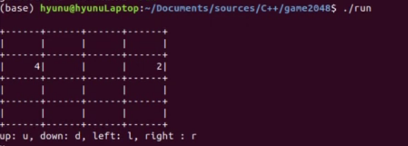
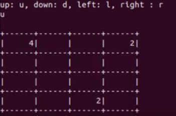

# 2048 game implementation with C
  
  here is simple 2048 game implementation with C++. 
  
  ### usage
    $ g++ game2048.cc -o run
    $ ./run
  
  ### how to play the game
  1. you can move the screen to 4 directions (up, down, right, left)
  2. the number is doubled if same nuber is overlapped
  3. you win once you create the number 2048
  4. you lose if you enter the direction that none of the number can move
  
    
  ### Usage Video Link:
https://www.youtube.com/watch?v=40fvd2VDi-s

### simple images
- start screen(randomly get two 2s)    

- move upward    

